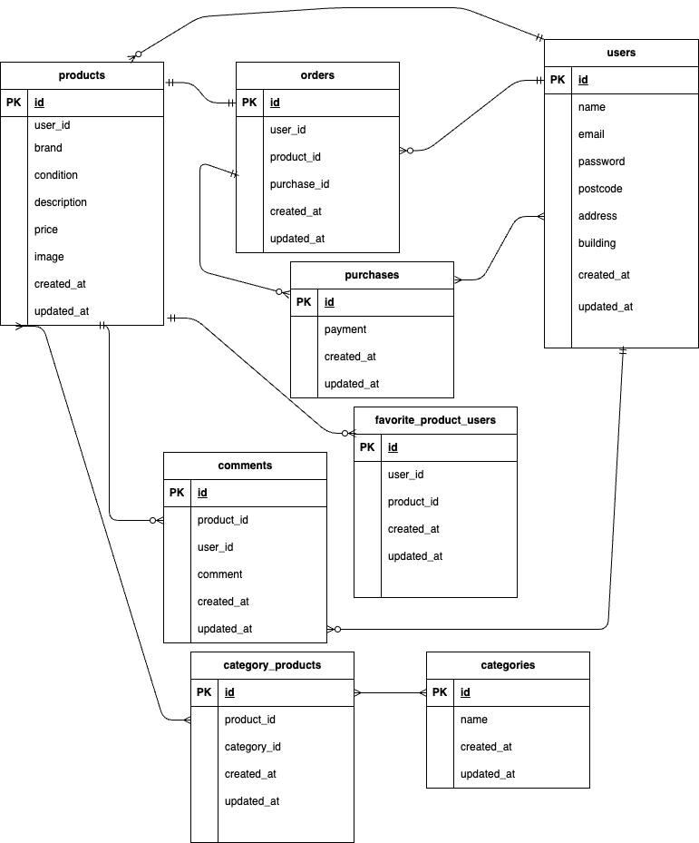

＃coachtechフリマ

#環境構築
Dockerビルド

1.git clone git@github.com/mitoma1/flea-market.git
2.DockerDesktopアプリを立ち上げる
3.docker-compose up -d --build

#Laravel環境構築

1.docker-compose exec php bash
2.composer install
3.「.env.example」ファイルを 「.env」ファイルに命名を変更。または、新しく.envファイルを作成
4..envに以下の環境変数を追加

DB_CONNECTION=mysql
DB_HOST=mysql
DB_PORT=3306
DB_DATABASE=laravel_db
DB_USERNAME=laravel_user
DB_PASSWORD=laravel_pass

#使用技術(実行環境) 
PHP7.4.9 Laravel8.83.8 MySQL8.0.26

## メール認証

ユーザー登録後にメールアドレス認証が必須です。  
開発環境では Mailhog を使って確認ができます。

### 設定内容

１User.php に implements MustVerifyEmail を追加
２、Fortify の機能により /email/verify にリダイレクト
３、認証メールは Mailhog で確認可能

  ### Mailhog 設定（.env）
MAIL_MAILER=smtp
MAIL_HOST=mailhog
MAIL_PORT=1025
MAIL_USERNAME=null
MAIL_PASSWORD=null
MAIL_ENCRYPTION=null
MAIL_FROM_ADDRESS=info@example.com
MAIL_FROM_NAME="${APP_NAME}"

　Mailhog： http://localhost:8025  
　認証後は /profile/setup に自動遷移
 
＃データベース初期化・ダミーデータ投入
1,マイグレーションを実行
php artisan migrate
2,Seederでダミーデータを投入
php artisan db:seed

＃初期投入されるダミーデータ
ユーザー（usersテーブル）
名前	メールアドレス	
佐藤	sato@example.com
	パスワードpassword123
鈴木	suzuki@example.com
	パスワードpassword123
森山	moriyama@example.com
	パスワードpassword123
＃商品・取引データ
.各ユーザーに複数の商品を登録済み

 ## 検索機能

### 商品検索（ヘッダーに実装）

商品名での部分一致検索が可能
ページネーション中も検索キーワードを保持
検索ワードはヘッダー内の検索欄に反映されます

＃ER図

#URL 開発環境：http://localhost/register
#phpMyAdmin:：http://localhost:8080/
